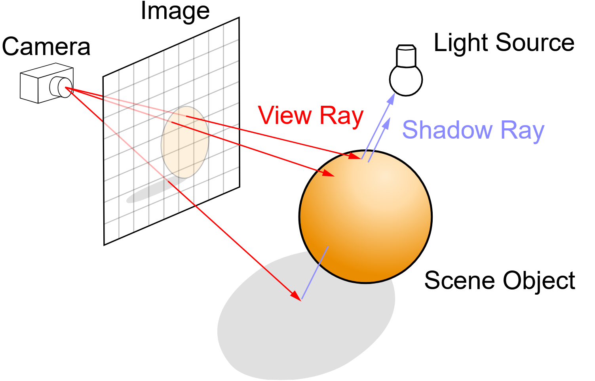
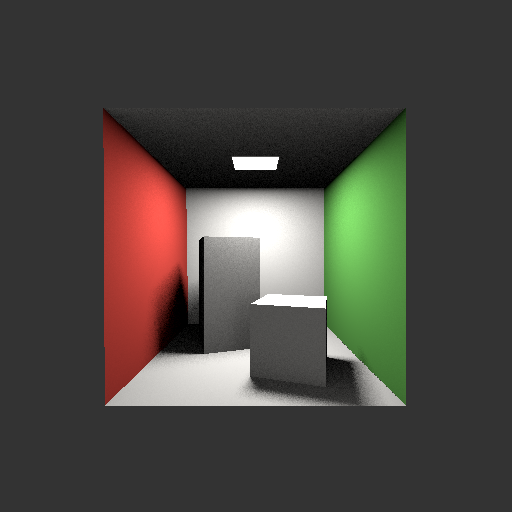

# ray tracing implementation in C++

## what is ray tracing?

Ray tracing is a solution to 3D computer graphics rendering.

The idea is to simulate how light behaves in the real world by tracing the path of light rays as they interact with objects in a scene. In simple terms, ray tracing starts with a virtual camera that “shoots” rays of light into a 3D scene.

## generating projects

gKit builds and runs on Linux, Windows, macOS, iOS, Android and even WebGL. Each platform has multiple compilers and IDEs. Manually creating and maintaining all those project files is impractical. gKit uses a project generator (Premake in this case) so you describe projects once and the tool generates the project files for your environment.

On Linux, `premake5` is often available from your package manager (install if necessary). For other systems, download it from https://premake.github.io/download/ and copy it into the `gkit3` directory.

Open a terminal and navigate to the gKit directory.

### Windows + Code::Blocks
`./premake5.exe codeblocks`

The Code::Blocks workspace and projects are created in the `build/` directory. Open `build/GKit3.workspace`.

### Windows + Visual Studio
`./premake5.exe vs2022`

The Visual Studio solution and projects are created in `build/`. Open `build/gkit3.sln`.

### macOS + Xcode
`./premake5 xcode`

### macOS + Makefile
`./premake5 gmake`

The Makefile is placed in the gKit root directory.

### Linux + Makefile
If `premake5` is installed system-wide:
`premake5 gmake`

Or, if `premake5` is copied to the gKit directory:
`./premake5 gmake`

The Makefile is placed in the gKit root directory.

> Note: If `premake5` is available from your distribution packages, use that — you don’t need to copy it into the gKit directory.

### Linux + VS Code
Generate the makefiles as described above (Linux + Makefile).

## build an example
Build `tp1` to verify that the application compiles and runs.

## using the Makefiles
Makefiles can produce debug builds (for use with a debugger like `gdb` or `lldb`) or release builds (faster — 2–3×, useful for compute-heavy projects):

- `make help` — lists projects and available options
- `make tp1` — builds the debug version of `tp1`
- `make tp1 config=release` — builds the release version of `tp1`
- `make tp1 config=debug` — builds the debug version of `tp1`
- `make tp1 verbose=1` — builds the debug version and prints the executed commands

Executables are created under `gkit3/bin`. To run an example:
`bin/tp1`

